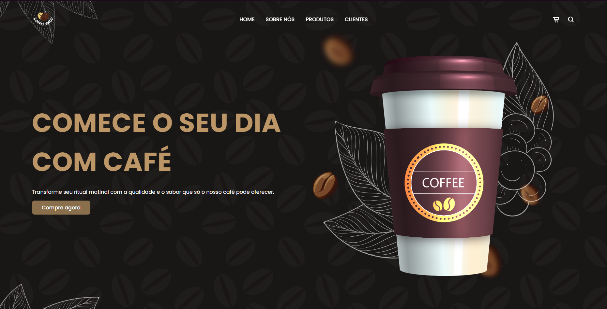

<h1 align="center"> Site de Café </h1>

  <a href="#-tecnologias">Tecnologias</a>&nbsp;&nbsp;&nbsp;|&nbsp;&nbsp;&nbsp;
  <a href="#-projeto">Projeto</a>&nbsp;&nbsp;&nbsp;&nbsp;&nbsp;&nbsp;

 

  

## Tecnologias

Esse projeto foi desenvolvido com as seguintes tecnologias:

- HTML
- CSS
- JavaScript

## 💻 Projeto

O website "Coffee Shop" é uma plataforma online responsiva que celebra a cultura do café por meio de uma experiência digital envolvente e adaptável a diferentes dispositivos. Desenvolvido com HTML, CSS e JavaScript, o site utiliza tecnologias modernas para garantir uma experiência de navegação otimizada em diversos dispositivos, incluindo desktops, tablets e smartphones. As tecnologias CSS Grid e Flexbox são empregadas para criar layouts flexíveis e fluidos, garantindo que o conteúdo seja apresentado de forma organizada e visualmente atraente em qualquer tamanho de tela. Além disso, o JavaScript é utilizado para adicionar funcionalidades interativas, como menus de navegação expansíveis e um cabeçalho que permanece fixo durante a rolagem. Essas tecnologias combinadas resultam em um website responsivo e moderno, proporcionando uma experiência de usuário consistente e agradável, independentemente do dispositivo utilizado para acessá-lo.
